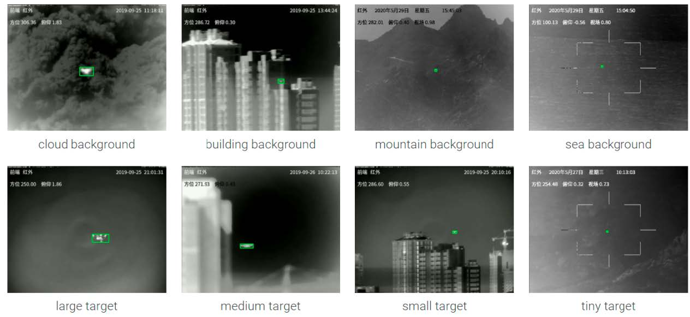

# AntiUAV: Co-DETR for Drone Tracking

[](LICENSE) [](https://www.python.org/downloads/release/python-3711/)

**Anti-UAV** is an extension of [Co-DETR](https://github.com/Sense-X/Co-DETR), specifically adapted for single object(e.g., drone) video tracking.

## Examples


## Usage

### Custom Dataset
- The COCO dataset and LVIS dataset should be organized as:
  ```
  Co-DETR
  └── data
      ├── coco
      │   ├── annotations
      │   │      ├── instances_train2017.json
      │   │      └── instances_val2017.json
      │   ├── train2017
      │   └── val2017
      │
      └── lvis_v1
          ├── annotations
          │      ├── lvis_v1_train.json
          │      └── lvis_v1_val.json
          ├── train2017
          └── val2017        
  ```
- Run `make_coco.py` to convert custom datasets into COCO format annotations.

### Filter Noise Results
- The result `.txt` file contains bounding box information in the following JSON format:
  ```txt
  {"res": [[x, y, w, h], ...]}
  ```
- Run `noise_filter_txt.py` or `noise_filter.py`. 
